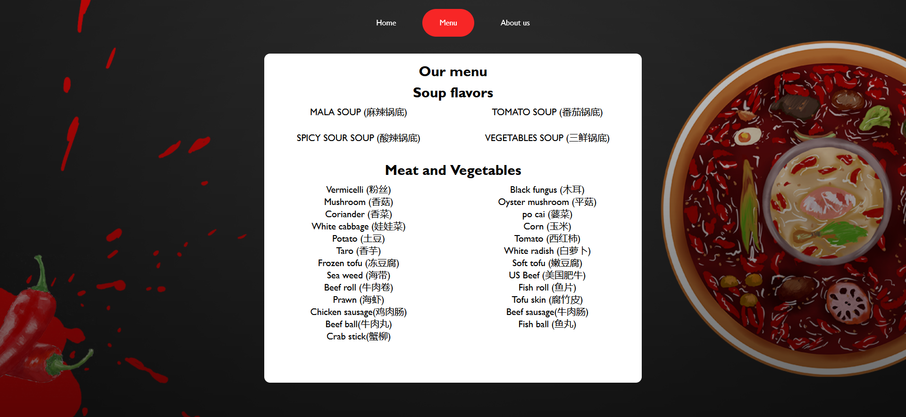
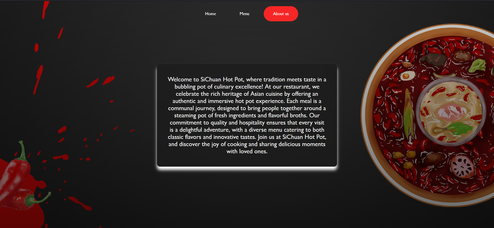

# restaurant-page

This is a solution to the [The odin project restaurant page](https://www.theodinproject.com/lessons/node-path-javascript-restaurant-page).

## Table of contents

- [Overview](#overview)
  - [The challenge](#the-challenge)
  - [Screenshot](#screenshot)
  - [Links](#links)
- [My process](#my-process)
  - [Built with](#built-with)
- [Author](#author)

## Overview

### The challenge

The main idea of the project is to build a restaurant page using javaScript modules and to practice using webPack.

### Screenshot

### Links

- Solution URL: [solution URL](https://github.com/bashair0/restaurant-page-/tree/main)
- Live Site URL: [live site URL](https://bashair0.github.io/restaurant-page-/)

## My process

### Built with

- Semantic HTML5 markup
- CSS custom properties
- webpack
- java script

## Author

- github - [bashair0](https://github.com/bashair0)
- Frontend Mentor - [@bashair0](https://www.frontendmentor.io/profile/bashair0)
